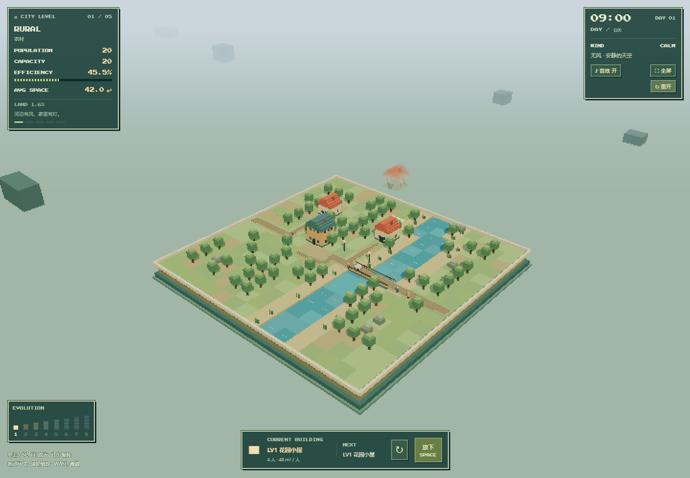

# Stack City · 城市生长实验

现有 3D 像素城市合成 MVP 的增量更新版，保留原项目架构与合成、物理、摄像机、NPC 和车辆系统。Vite + TypeScript + Three.js + Rapier 3D + HTML/CSS，无 React、无付费素材、无旧 2D 工程依赖。所有建筑、街景、车辆和居民均由几何体生成。



## 运行

需要 Node.js **20.19+ 或 22.12+**（推荐 Node 22/24）及随 Node 安装的 npm。

```sh
npm install
npm run dev
```

打开终端显示的本机地址，通常为 http://127.0.0.1:5173 。必须通过服务器运行，不能双击 index.html。浏览器需支持 WebGL2。运行中不下载字体、图片或其他外部素材。

```sh
npm run build     # TypeScript 检查 + 生产构建 → dist/
npm run preview   # 预览构建产物
npm test          # 真实 Rapier 物理与道路系统测试
```

压缩包包含完整源码、锁文件、测试和已构建的 dist；不包含 node_modules。用 
pm ci` 可按锁文件安装相同依赖。

## 操作与玩法

| 操作 | 功能 |
| --- | --- |
| 移动鼠标 | 在地块上定位半透明建筑预览，按 0.5 单位吸附 |
| 左键单击 / Space /「放下建筑」 | 从预览位置释放建筑 |
| 左键或中键拖动 | 360° 环绕城市，带阻尼 |
| 鼠标滚轮 | 缩放 |
| Q / E / 右键 /「旋转」 | 旋转待放建筑 90° |
| WASD / 方向键 | 用键盘微调 X/Z |
|「重新开始」 | 清空城市并恢复起始社区 |

开始时有三栋低层建筑。把两个同级建筑叠在一起最容易触发合成；左右相邻也可以，但必须真实接触。高速碰撞不会立即合成，等它们稳定约 0.22 秒后才升级。每次释放有 0.7 秒间隔。不同等级可以物理堆叠、倾倒、滑落；建筑相对竖直方向倾斜超过 45° 即触发碎块倒塌，恰好 45° 不触发。高空预览会抬升到当地建筑顶部之上。

超过 29 单位安全高度的建筑，在生成两秒后开始累计警告；持续超高十秒则暂停放置，仍可观察物理。倒塌使高度回落时，警告逐渐解除。最终塔本身不会越过安全高度。最多保留 100 栋建筑，限制仅阻止继续释放，不妨碍已有建筑合成。

## 建筑升级链

| Lv | 建筑 | 主体高度 | 人口 | 人均空间 |
| --- | --- | ---: | ---: | ---: |
| 1 | Tiny House / 花园小屋 | 1.2 | 4 | 48 m² |
| 2 | Row House / 联排住宅 | 1.7 | 12 | 38 m² |
| 3 | Town Apartment / 街角公寓 | 2.7 | 36 | 29 m² |
| 4 | Modern Apartments / 现代公寓 | 4.0 | 120 | 21 m² |
| 5 | Terrace Residence / 退台住宅 | 6.5 | 500 | 14 m² |
| 6 | Glass Balcony Residence / 玻璃阳台住宅 | 8.1 | 1,050 | 11 m² |
| 7 | Sky Garden Residence / 空中花园住宅 | 9.0 | 1,450 | 10 m² |
| 8 | Skyline Residence / 天际住宅 | 10 | 2,000 | 9 m² |
| 9 | Halo Arcology / 光环巨构 | 15 | 8,000 | 5.8 m² |
| 10 | Utopia Tower / 乌托邦之塔 | 22 | 100,000 | 3.2 m² |

1–3 级为经典风格，4–7 级为现代住宅（白色混凝土、楼板间玻璃、阳台与绿植），8–10 级为未来住宅（珍珠白塔楼、竖向玻璃、光环、玻璃天桥）。

人口是所有现存住宅的容量之和；人均空间按人口加权。Efficiency 是随人口对数增长的叙事指标，最高 99.8%，并非工程测量。占地利用率是建筑配置占地面积总和 / 地块面积（包含堆叠，封顶 100%），并非地面投影并集。

## 已完成

- PerspectiveCamera、约 45° 俯视、OrbitControls、缩放和俯仰限制。
- 16 × 16 隐藏规划网格、实体地块、低矮物理边界。
- 固定 60 Hz Rapier 模拟、动态刚体、立方碰撞体、CCD、摩擦/低弹性/稳定后阻尼，网格不锁定物理物体。
- 真正接触流形 + 线速度/角速度阈值 + 接触持续时间判定；合成配对锁定、防重复消耗、最高级封顶。
- 八级 voxel 建筑，四面窗户、屋顶、楼层边缘、霓虹色广告、外管和高层平台；合成粒子、提示和微震。
- 按当前建筑世界包围盒占地重建道路，入口方向优先；均匀网格 BFS 寻找最短空地连接到主路。道路、人行道、路缘、交叉口斑马线。
- NPC 沿道路边缘步行、转向、摆腿、停顿、在入口暂时隐藏；车辆沿道路中心线行驶。人口驱动数量上限分别为 65 / 22。
- 确定性街景生成：树木、长椅、路灯、后期广告牌。城市升级时绿化减少。
- 五个城市阶段、暖色到冷色夜景、160 栋 InstancedMesh 背景建筑与雾；阶段推进后远景增高。
- Population、Efficiency、Avg Living Space、占地利用率、建筑队列、升级图鉴、数字动画、Restart 和超高失败流程。
- 关闭抗锯齿、半分辨率渲染、CSS nearest-like 像素放大、硬边阴影；几何体/材质复用，NPC/车辆不进入物理世界。

## MVP 简化与扩展点

- 建筑碰撞是主体立方体，屋檐、天线、广告牌和平台只参与视觉；倾斜超过 45° 时建筑会碎成像素块，约 1.3–2.1 秒后消失，同时移除碰撞体和人口容量；碎块仅为视觉效果，不参与建筑碰撞。未实现其他灾害和重建。
- 道路以连接两岸的窄主路和木桥为骨架，每 0.8 秒检查占地变化；连接失败时不强行穿楼。使用旋转后 AABB 保守占地，倾倒或堆叠建筑会占更多规划空间。新生成道路会使用当前阶段的风格，旧路风格保留；没有信号灯、车辆避让或交通堵塞。
- 行人是采样人口，不对应 UI 全部人口；边缘偏移路径简化了人行道寻路。路网变化时角色重新分配位置，进楼只是短暂隐藏后继续行走，未实现真正室内、跨楼传送或集体奔向最终塔。
- 夜景使用共享 emissive 材质 + 高亮阈值 Bloom，最多两盏真实路灯光源。昼夜每 8 分钟循环一次，窗户、路灯、车灯、人流和天空平滑变化。
- 最高塔已有最终庆祝、超高模型、人口指标与镜头拉远，已加入近邻高楼之间的视觉空中连廊和原创合成音效，但没有过场动画、存档或移动端完整触控适配。优先支持桌面鼠标键盘。
- 树、路灯、长椅与广告牌已实现；垃圾桶、邮箱、电话亭、遛狗等扩展装饰未实现。
- 无美术纹理，因此不需要纹理过滤设置；以后引入像素贴图时应使用 `NearestFilter`。
- Rapier WASM 通过 compat 包内嵌，生产包约 2.8 MB（gzip 约 1 MB）；Vite 会提示大 chunk，不影响构建运行。Rapier 0.19.3 自身初始化会输出一条 deprecated parameters 提示，仿真测试正常。

## 项目结构

```text
stack-city/
├── index.html
├── package.json
├── package-lock.json
├── tsconfig.json
├── README.md
├── preview.png
├── dist/                         已验证生产构建
├── tests/systems.test.ts          真实物理与路网回归测试
└── src/
    ├── main.ts
    ├── game/Game.ts               生命周期、输入、固定步长、系统编排
    ├── scenes/CityScene.ts        渲染、地块、灯光
    ├── camera/CameraController.ts
    ├── systems/
    │   ├── BuildingSystem.ts
    │   ├── MergeSystem.ts
    │   ├── PhysicsSystem.ts
    │   ├── RoadSystem.ts
    │   ├── PathfindingSystem.ts
    │   ├── NPCSystem.ts
    │   ├── VehicleSystem.ts
    │   ├── DecorationSystem.ts
    │   ├── ProgressionSystem.ts
    │   ├── PopulationSystem.ts
    │   ├── BackgroundCitySystem.ts
    │   ├── WindSystem.ts             随机风况、高度风压与风线
    │   ├── TerrainSystem.ts          随机河流、禁建和桥梁掩码
    │   ├── TimeOfDaySystem.ts        8 分钟昼夜、夜间人流系数
    │   ├── SoundSystem.ts            Web Audio 原创音效与静音
    │   ├── EffectsSystem.ts
    │   └── UIManager.ts
    ├── entities/
    │   ├── Building.ts            voxel 模型生成入口，可替换为模型加载器
    │   ├── NPC.ts
    │   └── Vehicle.ts
    ├── data/
    │   ├── buildings.ts           体积、人口、空间与配色
    │   ├── progression.ts         阶段阈值、天空、绿化与叙事
    │   └── cityConfig.ts          物理步长、地块、超高阈值
    ├── utils/
    │   ├── grid.ts
    │   ├── math.ts
    │   └── mesh.ts
    └── styles/style.css
```

## 验证记录

2026-09-29，Windows + Node 24.19.0：

- 
pm install` 成功。
- 
pm run build` 成功（TypeScript 无错误；仅打包体积提示）。
- 
pm test` 通过：重力、真实低速接触、全部七次升级、非接触不合成、不同级堆叠、动态刚体保留、道路避障与入口连通、最短路径绕障、人口统计、最高级封顶、清空重置。
- 
pm run dev` 成功；本机 Edge 浏览器加载、两次释放自动合成、拖动视角、缩放、旋转、重开已执行，无页面运行错误。两次释放后人口 32、合成次数 1；重开后恢复人口 20。
- 1440 × 1000 实际运行截图见 `preview.png`。

API 参考：[Rapier](https://rapier.rs/docs/user_guides/javascript/getting_started_js/)、[Three.js OrbitControls](https://threejs.org/docs/pages/OrbitControls.html)。

## 本次更新：屋顶与倒塌

- 修复屋顶盖板与主体顶面的共面闪烁，并调整屋顶设备和低层阶梯屋顶。
- 新增超过 45° 的即时倒塌，像素碎块继承原建筑姿态和运动，短暂落地后缩小消失；同时更新道路占地与人口。
- 新增阈值、复合倾斜、水平旋转无关性、单次触发、碰撞体清除、碎块寿命与重开清理测试；原合成测试仍全部通过。


## 本次增量：天气、地形、昼夜、HUD 与音效

直接扩展原有系统，没有重建项目。

- **风况**：CALM（18–35 秒）、BREEZE（16–28 秒）、STRONG WIND（12–20 秒）随机轮换，约 4 秒过渡；风向平滑变化。无风稳定后风力严格为零、风线隐藏。7 单位高度以上风压按高度平方增加。预览没有刚体，确认释放时仅启用物理；接触下方支撑、线速度和角速度都降低并连续稳定 0.8 秒后，才开启受风。之后摇晃不会重新获得免风；合成后的新建筑重新等待落稳。
- **质量与稳定性**：8 级质量依次为 4 / 10 / 25 / 65 / 180 / 650 / 1750 / 4750。风压作用于立面面积与高处施力点，不按质量等比例增加，因此重建筑加速度更小。开局首建筑及其合成继承者，在地面第一层时免受风；抬高后仍受风。45° 倒塌规则保留。
- **随机地图**：重开生成新种子，连续弯曲河流贯穿地块，两岸有草地、土地、芦苇和石块。河流、岩石禁止直接放置，红色地面预览标记提示。两岸通过预留木桥连接；道路只在桥梁格跨河。地形起伏以 voxel 土层、河床凹槽和岩石表现，可建设地面仍为平面以保留现有物理手感；不模拟水流冲击或建筑沉水。
- **窄道路**：主路宽 0.82、支路 0.50、入口连接 0.34，两侧人行道合计加宽 0.18（世界单位）。占地检测同步缩窄，为密集城区保留更多连接空隙。仍按原 16×16 网格寻路，完全被建筑封闭的入口不保证可达。
- **昼夜**：每 480 秒一昼夜，从 09:00 开局；Morning / Day / Sunset / Night 连续插值，跨午夜累加 DAY。农村夜间活动约为白天的 14%，最终阶段约为 92%；人数逐步调整，黄昏更多行人选择入口。
- **灯光**：低级房屋少量暖色窗，高楼密集灯光；路灯、车辆前后灯、招牌、霓虹使用共享发光材质。EffectComposer + RenderPass + UnrealBloomPass + OutputPass 在半分辨率画布上工作，阈值 1.25，后期夜景更明显。resize 同步更新 renderer、camera、composer。
- **阶段**：按达到过的人口容量升级，阈值为 RURAL 0、TOWNSHIP 300、URBAN 1,500、METRO 7,000、FUTURE CITY 30,000。人口回落不会抹去已解锁时代。已有房屋保留，新建筑可带商铺雨棚与招牌；新道路采用新样式，装饰逐步补充，部分树木渐退，远景逐步变高变密。相邻的 8–10 级未来塔楼之间会出现玻璃天桥（仅视觉，不参与碰撞或交通）。
- **HUD**：全浏览器窗口画布，左上人口/容量/效率/人均空间，右上时钟/天数/风况/风向，底部建筑队列。角落有全屏、重开、音效开关。字体随项目本地打包，不依赖在线字体服务。
- **原创音效**：合成三连上扬“啵啵啵”、放置低沉重音、实际落地碰撞、倒塌碎裂、阶段升级、旋转、无效放置、重开和风力/高度警告；强风时有轻微风声。均为 Web Audio 振荡器与噪声合成，不包含任何商业游戏的原始音频。首次点击或按键后解锁音频；音效开关记忆在本地，24 个短音并发上限并自动释放节点。

Population 与 Capacity 在本 MVP 中均以住宅容量统计，未单独模拟入住率。新出现的街景和连廊是视觉扩展，没有改动原 NPC/车辆的道路移动基础。

### 增量验证

- `npm run build`：TypeScript 和生产构建通过。
- `npm test`：原物理与七次合成升级回归、45° 倒塌、风压和质量；40 个随机种子的河流连通/禁建/小桥/初始道路检查；昼夜、阶段阈值、随机风况和无风过渡全部通过。
- 浏览器：河中放置被拒绝、连续释放自动合成、重开更换地图、强风下预览不偏移、昼夜切换、阶段保留旧楼、720×800 resize（含后处理）通过，无页面错误。
- Web Audio：全部短音输出非零且未削波；静音跨刷新保存；并发限制、节点释放和用户交互解锁通过。
- 截图：`preview.png` 白天农村、`preview-night.png` 农村夜晚、`preview-metro-night.png` 都市夜景。

字体：Press Start 2P，SIL Open Font License 1.1；字体与许可证位于 `src/assets/`。Three.js、Rapier 及其他依赖遵循各自许可证。


## 实时总分

底部建筑描述栏已替换为总分、人口分、建筑等级分和道路奖励，保留旋转/放下按钮。当前与下一个建筑可通过放下按钮的悬停提示查看。

总分 = 人口分 + 建筑等级分 + 道路奖励。人口每人 1 分；Lv1–8 单栋建筑分别为 100 / 250 / 650 / 1700 / 4500 / 12000 / 32000 / 85000 分。道路奖励最高为基础分的 30%。通畅度由 75% 的建筑接通率和 25% 的路网可达率构成；从地块西侧入口沿实际道路与合法桥梁计算，断开的主路片段不算接通。这里衡量道路连通性，不模拟车辆拥堵。

分数反映当前城市状态，建筑倒塌或道路中断会扣减相应得分，修复连接后恢复；空城市不能仅靠道路获得奖励。道路检查随现有路网更新，最多约有 0.8 秒延迟。规则可在 src/data/scoring.ts 调整。
`n夜间天气微调：强风候选权重随夜色从 1.0 平滑升至 1.25。由无风/微风切换时，强风概率由白天 50% 提升至深夜约 55.6%；强风强度、持续时间及不能连续抽到同状态的规则不变。


### 手机触控
- 点画面选择落点，点「放下」放置。
- 长按「放下」约 0.3 秒，拖动微调，松手放置；预览无物理、无风。
- 单指滑动画面旋转视角；点击 ↻ 旋转按钮，每次旋转建筑 90°。
- 双指捏合缩放；第二根手指加入会取消放置手势。
- 支持横竖屏、安全区域；鼠标键盘操作保留。
- 同 Wi-Fi 手机访问：运行 npm run dev -- --host 0.0.0.0 ，手机打开终端的 Network 地址。127.0.0.1 只能本机访问。

开局建筑队列：1 级 60%、2 级 40%，包含初始待放建筑；倒塌保留物理和碎块效果，不显示倾斜角度提示。

每级住宅提供 3 种随机装饰外观（花草阳台、遮阳光伏、生活设备），共 24 个等级/外观组合。仅改变小装饰，预览与放下的外观一致，合成仍按建筑等级判断。

手机 HUD 沿屏幕中轴排列，右上角 Ⅱ 打开暂停菜单，包含音效、全屏、重开和继续游戏。菜单打开时暂停物理、城市时间与道具冷却；电脑可按 Escape 切换。导弹按钮切换拆除模式，使用同一选点/长按微调/放下操作，击中最上方单栋住宅后拆除，冷却 60 秒；无目标不消耗冷却，建筑队列不受影响。再次点击导弹可取消选择。

性能优化：住宅、道路、静态地形按材质合并绘制；建筑包围盒缓存，减少逐帧遍历；手机使用 1024 阴影贴图和 8 组随机窗灯材质，保留随机开关/高亮；窗户不再投射细碎阴影；人车缓存道路节点。合成/拆除/重开释放合批几何体，物理步长和玩法不变。
